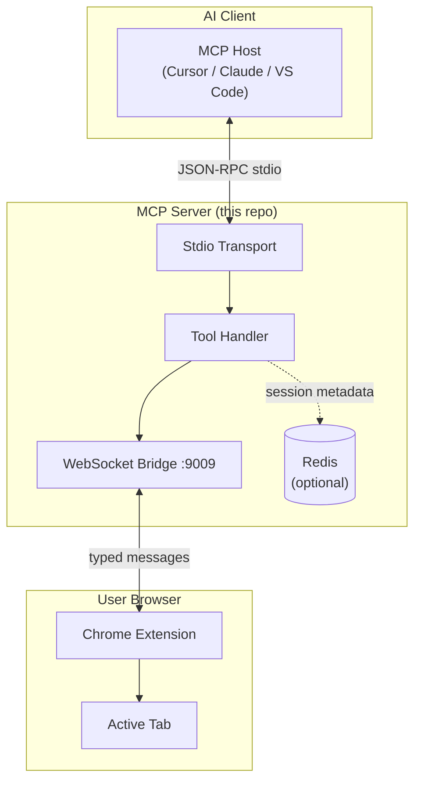
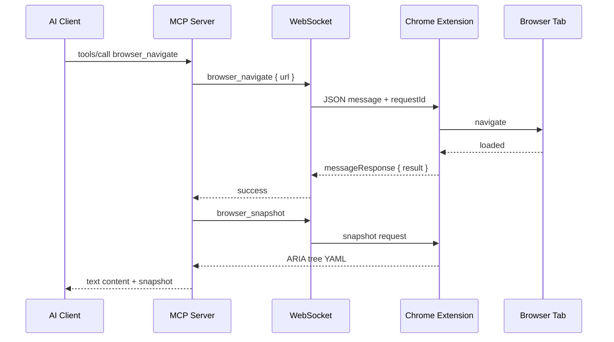

# Browser MCP Server

A production-ready [Model Context Protocol (MCP)](https://modelcontextprotocol.io) server that bridges AI assistants to your local browser through a Chrome extension.

> Control navigation, interaction, snapshots, and screenshots from Cursor, Claude Desktop, VS Code, Windsurf, and any MCP-compatible client — without launching a separate browser instance.

---

## Table of Contents

- [Overview](#overview)
- [Architecture](#architecture)
- [Features](#features)
- [Requirements](#requirements)
- [Installation](#installation)
- [Configuration](#configuration)
- [Development](#development)
- [Testing](#testing)
- [Project Structure](#project-structure)
- [Troubleshooting](#troubleshooting)
- [Contributing](#contributing)
- [FAQ](#faq)
- [License](#license)

---

## Overview

Browser MCP connects an AI client (via stdio MCP transport) to a Chrome extension (via local WebSocket). The extension operates on your **existing browser profile**, preserving login sessions and reducing bot-detection friction compared to headless automation.



---

## Architecture

### Request Flow



### Component Responsibilities

| Module | Role |
|--------|------|
| `src/index.ts` | CLI entry point, tool registration, lifecycle |
| `src/server.ts` | MCP protocol handlers (tools/resources) |
| `src/context.ts` | Typed WebSocket RPC to the extension |
| `src/messaging/` | Request/response correlation over WebSocket |
| `src/tools/` | Browser automation tool implementations |
| `src/persistence/` | Optional Redis session metadata store |
| `src/config/` | Environment-driven configuration |

---

## Features

| Capability | Tools |
|------------|-------|
| **Navigation** | `browser_navigate`, `browser_go_back`, `browser_go_forward`, `browser_wait` |
| **Interaction** | `browser_click`, `browser_hover`, `browser_type`, `browser_select_option`, `browser_drag`, `browser_press_key` |
| **Inspection** | `browser_snapshot`, `browser_screenshot`, `browser_get_console_logs` |
| **Persistence** | Optional Redis-backed session and tool-call metadata |
| **Observability** | Structured stderr logging with configurable log levels |
| **Standalone build** | No private monorepo dependencies required |

---

## Requirements

- **Node.js** 18 or later
- **Chrome** with the [Browser MCP extension](https://browsermcp.io) installed
- **Redis** 6+ (optional, for session persistence)

---

## Installation

### From source

```bash
git clone https://github.com/BrowserMCP/mcp.git
cd mcp
npm install
npm run build
```

### MCP client configuration

Add to your MCP client settings (example for Cursor / Claude Desktop):

```json
{
  "mcpServers": {
    "browsermcp": {
      "command": "node",
      "args": ["/absolute/path/to/mcp/dist/index.js"]
    }
  }
}
```

Or use the published binary after linking:

```bash
npm link
# command: mcp-server-browsermcp
```

### Connect the extension

1. Start your MCP client (which launches this server).
2. Open Chrome and click the Browser MCP extension icon.
3. Click **Connect** on the active tab.
4. Invoke tools from your AI assistant.

---

## Configuration

Copy the example environment file and adjust values:

```bash
cp .env.example .env
```

| Variable | Default | Description |
|----------|---------|-------------|
| `WS_PORT` | `9009` | WebSocket port for the Chrome extension |
| `LOG_LEVEL` | `info` | Log verbosity: `debug`, `info`, `warn`, `error` |
| `REDIS_ENABLED` | `false` | Enable Redis session persistence |
| `REDIS_HOST` | `127.0.0.1` | Redis hostname |
| `REDIS_PORT` | `6379` | Redis port |
| `REDIS_PASSWORD` | _(empty)_ | Redis authentication password |
| `REDIS_DB` | `0` | Redis database index |
| `REDIS_KEY_PREFIX` | `browsermcp:` | Key namespace prefix |
| `REDIS_CONNECT_TIMEOUT_MS` | `10000` | Connection timeout |
| `REDIS_MAX_RETRIES` | `10` | Reconnection attempts |
| `REDIS_SESSION_TTL_SECONDS` | `86400` | Session key TTL (24 h) |

When Redis is enabled, the server records connection events, disconnection timestamps, and tool-call counts — useful for debugging and operational monitoring.

---

## Development

```bash
# Install dependencies
npm install

# Watch mode
npm run dev

# Type check
npm run typecheck

# Lint
npm run lint

# Run all checks
npm run validate
```

### MCP Inspector

Debug tool schemas and handlers interactively:

```bash
npm run build
npm run inspector
```

---

## Testing

```bash
# Run all tests
npm test

# Watch mode
npm run test:watch
```

Tests cover environment parsing, error formatting, async utilities, and Redis session store logic (with mocked clients).

---

## Project Structure

```
mcp/
├── docs/
│   └── AUDIT.md              # Engineering audit notes
├── src/
│   ├── config/               # App + environment configuration
│   ├── messaging/            # WebSocket RPC layer
│   ├── persistence/          # Redis connection + session store
│   ├── resources/            # MCP resource type definitions
│   ├── tools/                # Browser automation tools
│   ├── types/                # Shared Zod schemas and message types
│   ├── utils/                # Logging, errors, port helpers
│   ├── context.ts            # Extension connection context
│   ├── index.ts                # CLI entry point
│   ├── server.ts             # MCP server factory
│   └── ws.ts                 # WebSocket server lifecycle
├── tests/                    # Vitest unit tests
├── .env.example              # Configuration template
├── eslint.config.js          # ESLint flat config
├── tsup.config.ts            # Build configuration
├── tsconfig.json             # TypeScript (source)
├── tsconfig.test.json        # TypeScript (tests + lint)
└── vitest.config.ts          # Test runner config
```

### Design Decisions

- **Stdio transport only** — MCP clients spawn the server as a subprocess; stdout is reserved for the protocol.
- **Stderr logging** — All diagnostics go to stderr to avoid corrupting MCP messages.
- **Optional Redis** — Persistence is opt-in; the server runs fully without Redis for local development.
- **Typed WebSocket RPC** — Every extension message is typed end-to-end for compile-time safety.

---

## Troubleshooting

### "No connection to browser extension"

The Chrome extension is not connected. Open the extension popup and click **Connect** on the target tab.

### Port already in use

Another process holds `WS_PORT` (default 9009). Either stop the conflicting process or set a different port:

```bash
WS_PORT=9010 node dist/index.js
```

### Redis connection failures

If Redis is enabled but unreachable, the server logs an error and continues **without** persistence. Verify Redis is running:

```bash
redis-cli ping
# PONG
```

### Tools return timeout errors

The extension did not respond within 30 seconds. Ensure the tab is active and the extension is connected. Increase load times with `browser_wait`.

### MCP client shows no tools

Confirm the server binary path in your MCP config is absolute and that `npm run build` completed successfully.

---

## Contributing

1. Fork the repository and create a feature branch.
2. Install dependencies: `npm install`
3. Make changes with tests: `npm run validate`
4. Submit a pull request with a clear description and test plan.

### Commit Guidelines

- One logical change per commit.
- Use conventional prefixes: `feat:`, `fix:`, `refactor:`, `test:`, `docs:`, `chore:`.
- Run `npm run validate` before pushing.

---

## FAQ

**Does this launch a new browser?**
No. It controls your existing Chrome profile through an extension.

**Is my data sent to remote servers?**
Automation runs locally. Data only flows between your AI client, this server, and your browser.

**Do I need Redis?**
No. Redis is optional and disabled by default.

**Which browsers are supported?**
Chrome and Chromium-based browsers with the Browser MCP extension.

**How is this different from Playwright MCP?**
Playwright MCP launches browser instances. Browser MCP uses your logged-in profile via a Chrome extension, reducing CAPTCHA and login friction.

**Can multiple extensions connect?**
Only one WebSocket connection is active at a time. A new connection replaces the previous one.

---

## License

Apache License 2.0 — see [LICENSE](LICENSE).

Adapted from the [Playwright MCP server](https://github.com/microsoft/playwright-mcp) with a browser-extension architecture for profile reuse and stealth automation.
